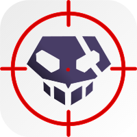

<p align="center">
  
</p>

<h1 align="center">Hollows Hunter</h1>

<p align="center">
  <b>Advanced in-memory threat scanner with VirusTotal integration</b>
</p>

<p align="center">
  <a href="https://github.com/cyifog7/hollows_hunter/releases"></a>
  <a href="https://github.com/cyifog7/hollows_hunter/releases"></a>
  <a href="https://github.com/cyifog7/hollows_hunter/blob/master/LICENSE"></a>
  
  
</p>

---

Hollows Hunter scans running processes for in-memory threats: replaced/implanted PEs, shellcodes, hooks, patches, and more. Built on top of [PE-sieve](https://github.com/hasherezade/pe-sieve), with added features:

- **VirusTotal integration** — automatic hash lookup for every suspicious dump
- **Config file** — `hollows_hunter.ini` generated on first run, no need to repeat CLI args
- **Rate limiting** — respects VT free tier (4 req/min)
- **Admin enforcement** — requires elevation via manifest + runtime check
- **ETW monitoring** — real-time event-driven scanning (64-bit)
- **Continuous scanning** — loop mode for persistent monitoring

## Quick Start

```
hollows_hunter.exe
```

That's it. Scans all processes, dumps suspicious modules, queries VirusTotal automatically.

### Target specific processes

```
hollows_hunter.exe /pname svchost.exe
hollows_hunter.exe /pid 1234
```

### Continuous monitoring

```
hollows_hunter.exe /loop
hollows_hunter.exe /etw
```

### Skip VT for known false positives

```
hollows_hunter.exe /vtignore AnyDesk.exe;TeamViewer.exe
```

## Detection Capabilities

| Type | Description |
|------|-------------|
| **Process Hollowing** | Replaced PE headers in memory |
| **PE Injection** | Implanted executables in foreign processes |
| **Shellcode** | Raw shellcode and code caves |
| **API Hooking** | Inline hooks and IAT patches |
| **Memory Patches** | In-memory code modifications |
| **.NET Implants** | Managed code modifications |

## VirusTotal Integration

Every suspicious dump is automatically hashed (SHA256) and looked up on VirusTotal. Results appear inline:

```
>> Detected: 2812
   [VT] 74b30000.PEbiosinterface32.dll : 12/69 (trojan)
```

JSON reports include full VT data:

```json
{
  "virustotal": {
    "score": "12/69",
    "threat_label": "trojan",
    "sha256": "b7b4e30f045201...",
    "permalink": "https://www.virustotal.com/gui/file/..."
  }
}
```

Per-dump `.vt.json` files are written to the output directory.

### Setup

To enable VirusTotal, open `hh_params.cpp` and replace the placeholder with your API key:

```cpp
vt_api_key = "YOUR_VT_API_KEY_HERE";
```

Get a free key at [virustotal.com/gui/join-us](https://www.virustotal.com/gui/join-us) (4 lookups/min on free tier).

Then rebuild. Alternatively, pass it via CLI with `/vt <key>` or set it in `hollows_hunter.ini`.

## Configuration

On first run, `hollows_hunter.ini` is created next to the executable:

```ini
; HollowsHunter configuration
; CLI arguments override these values

; Skip VT lookups for these processes (separated by ;)
vt_ignore=AnyDesk.exe

; Ignore these processes from scanning (separated by ;)
pignore=

; Output directory
dir=hollows_hunter.dumps

; Options: true/false
quiet=false
log=false
json=false
loop=false
unique_dir=false
hooks=false
suspend=false
kill=false
```

CLI arguments always take priority over the config file.

## Parameters

### Scan Targets
| Param | Description |
|-------|-------------|
| `/pid <PID[;PID]>` | Scan specific PIDs |
| `/pname <name[;name]>` | Scan by process name |
| `/ptimes <seconds>` | Only processes created within N seconds |

### Scan Options
| Param | Description |
|-------|-------------|
| `/hooks` | Detect inline hooks and patches |
| `/shellc` | Shellcode detection |
| `/obfusc` | Obfuscation/encryption detection |
| `/threads` | Scan thread callstacks |
| `/iat` | IAT hook detection |
| `/data` | Scan non-executable pages |
| `/refl` | Process reflection mode |

### Monitoring
| Param | Description |
|-------|-------------|
| `/loop` | Continuous scanning |
| `/etw` | ETW event-driven mode (x64, admin) |
| `/cache` | Module caching for repeated scans |

### Output
| Param | Description |
|-------|-------------|
| `/dir <path>` | Output directory |
| `/json` | JSON summary |
| `/log` | Append to log file |
| `/uniqd` | Timestamped output directories |
| `/quiet` | Suppress console output |

### Post-Scan Actions
| Param | Description |
|-------|-------------|
| `/suspend` | Suspend suspicious processes |
| `/kill` | Terminate suspicious processes |
| `/vtignore <name[;name]>` | Skip VT lookups for these processes |

## Build

Requires Visual Studio 2022 and CMake.

```
git clone --recursive https://github.com/cyifog7/hollows_hunter.git
cd hollows_hunter
mkdir build && cd build
cmake .. -G "Visual Studio 17 2022" -A x64
cmake --build . --config Release
```

The executable will be in `build/Release/hollows_hunter.exe`.

## Based On

- [PE-sieve](https://github.com/hasherezade/pe-sieve) by hasherezade — core scanning engine
- [krabsetw](https://github.com/microsoft/krabsetw) by Microsoft — ETW tracing
- [VirusTotal API v3](https://docs.virustotal.com/reference/overview) — threat intelligence

## License

BSD 2-Clause. See [LICENSE](LICENSE).
